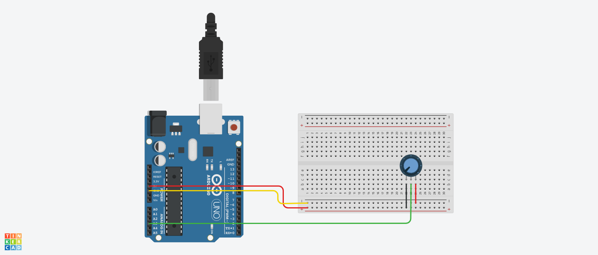

# arduino-js-brightness-controller

Control brightness of your computer using Arduino and some potentiometers.

## Diagram



## you will need

* Arduino
* Few jumper wires
* Potentiometers
* breadboard

## First: Using Firmata Client Libraries with JS

* Go to <a href="https://create.arduino.cc">Arduino Editor</a> and select Web Editor from the options.
* Download the Plugin from here and once it is completed, open Arduino App on PC.
* The Plugin icon should appear at Taskbar. Click on it and Go to Arduino Create, or go back to <a href="https://create.arduino.cc">Web Editor</a>.
* Connect your Arduino Uno using USB to PC.
* Create a New Sketch from Web Editor.
* Go to Libraries and search for Firmata.
* Scroll down the > Examples, find StandardFirmataPlus and click on it.
* Click on Upload.
* The Arduino would start blinking. You will get the message Success: Done uploading StandardFirmataPlus.

And make a structure like the diagram above.

## Setup

Go into powershell on windows or terminal on mac and write: 

```sh
$ git clone https://github.com/zaidajani/arduino-js-brightness-controller.git

$ cd arduino-js-brightness-controller

# Clone and get into the folder

$ npm install

# install npm dependencies.

$ node sketch.js
```

## Enjoy your powerfull application
